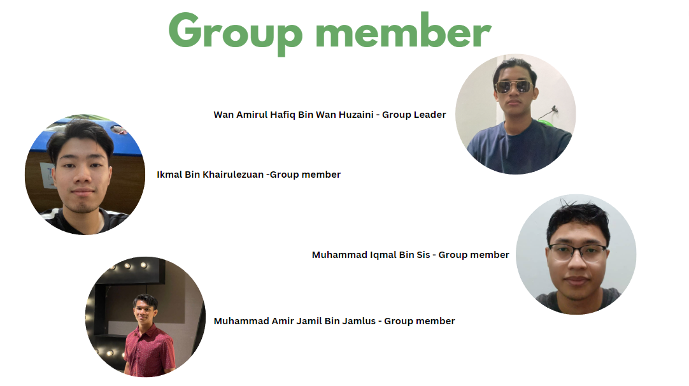

# Mini Project PKU UTM System

## Introduction
Our mini project is an appointment system for Universiti Teknologi Malaysia's Pusat Kesihatan UTM. It helps staff track patients and prevent overcrowding. The system can add, display, delete, search for patients, and exit. We used a queue-linked list for adding, displaying, and deleting patients, and a searching method for searching patients.

## Objective 
- Standardization of the patient registration process
- Uniform data management
- Increase the efficiency of data entry, query, and deletion, in terms of time
- Produce an easy-to-understand interface
- Ease of navigation to improve user experience
- Customization of the size of patient intake

## Group Member

